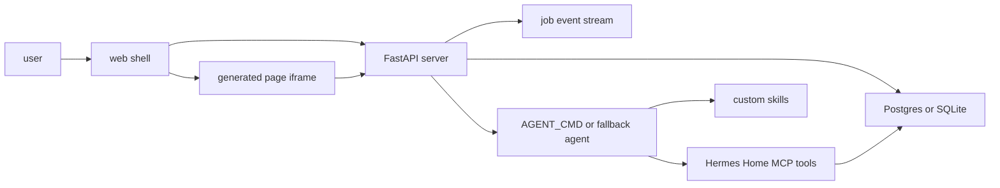

# Hermes Home V1 Product Plan

## Goal

Hermes Home v1 is a local-first home command center. The user enters one command, Hermes performs the work, streams visible job steps, publishes a generated page, and page actions update durable state. The app does not expose a chat transcript as the primary UI.

The first shippable slice is:

- Command in through the app API.
- Job progress out through server-sent events.
- Generated HTML page stored immutably.
- Page buttons call typed actions.
- Tiles, todos, notes, approvals, and calendar state refresh from the database.

## Principles

- The app server owns HTTP, auth, persistence, sanitization, SSE, and the agent invocation boundary.
- The web client is a Metro-style shell driven by server JSON. It should not contain business rules that can drift from the server.
- Agent output is delivered as pages, not conversational replies.
- Every state-changing workflow emits job events when `HERMES_HOME_JOB_ID` is present.
- Calendar writes are approval-gated. Reads can be cached; writes must create an approval request first.
- SQLite is acceptable for local development and tests. Postgres with pgvector is the deployment contract.

## Runtime Architecture



## Core Objects

- `jobs`: one command execution and its final page status.
- `job_events`: append-only progress log for SSE and audits.
- `pages`: immutable sanitized HTML artifacts created by jobs.
- `tiles`: compact live summaries shown on the first screen.
- `todos`: home tasks created from commands or page actions.
- `notes`: categorized memory snippets and reference material.
- `categories`: stable note taxonomy.
- `approvals`: gated actions, especially calendar writes.
- `calendar_sync`: provider cursor and sync status.

## API Contract

All `/api/*` routes require `Authorization: Bearer $HOME_API_TOKEN`.

- `GET /api/tiles`: returns tiles in `sort_order`.
- `GET /api/todos`: returns todos, newest first unless filtered.
- `GET /api/notes`: returns categorized notes.
- `GET /api/jobs`: returns recent jobs.
- `GET /api/jobs/{id}`: returns one job and page linkage.
- `GET /api/jobs/{id}/events`: returns SSE-compatible event text.
- `GET /api/pages/{id}`: returns a stored page.
- `POST /api/command`: creates and runs a job.
- `POST /api/actions`: executes typed page actions.

## Agent Contract

When the server invokes Hermes or another agent command, it sets:

- `DATABASE_URL`: database connection string.
- `HERMES_HOME_JOB_ID`: active job id for progress logging.
- `HOME_API_TOKEN`: API token if the agent needs to call the app server.

The agent uses the MCP tools to write todos, notes, pages, approvals, calendar requests, and tile updates. It should emit short job events for each meaningful step. It should finish by publishing a page, because the web app treats a page as the durable result of a job.

## Generated Page Rules

Generated pages must be self-contained HTML fragments or documents:

- No scripts.
- No external CSS, images, fonts, iframes, or network loads.
- No inline event handlers such as `onclick`.
- Actions use buttons or links with `data-action` and JSON-safe `data-payload`.
- Page copy should be concise and directly useful.

## Deployment Shape

Local deployment uses Docker Compose:

- `postgres`: `pgvector/pgvector:pg16`, initialized with `db/schema.sql`.
- `app`: Python runtime that installs the server package and serves FastAPI.

Production can keep the same database schema and replace the app service image with a pinned build. Database migrations should preserve immutable page content and append-only job events.

## Verification

Task-level verification:

```sh
python - <<'PY'
from pathlib import Path
for p in ['db/schema.sql','.env.example','docker-compose.yml']:
    assert Path(p).read_text().strip()
print('docs ok')
PY
```

Full local verification after all implementation tasks:

```sh
cd server && python -m pytest -q
cd web && npm test -- --run && npm run build
docker compose up postgres
```

